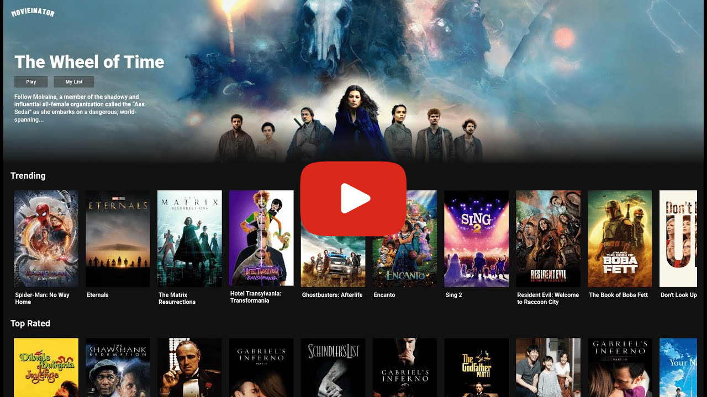

# Movieinator

**Movieinator** is a Website made in React which shows details of different Movies and TV Shows. It fetches the data from **TMDB API**. It's UI if inspired from Netflix's UI.

Live Demo : [https://movieinator.vercel.app/](https://movieinator.vercel.app/)

Github Link : [https://github.com/akathecoder/movieinator](https://github.com/akathecoder/movieinator)

API Link : [https://developers.themoviedb.org/3/getting-started/introduction](https://developers.themoviedb.org/3/getting-started/introduction)

## Tech Stack


## Video Demo

<a href="https://www.youtube.com/watch?v=uWMfVNYhmQ0" alt="Movieinator Live Demo" target="_blank">



</a>

<br/>

## Development Setup

### Pre Requisites:

- [NodeJS](https://nodejs.org/en/)
- [NPM](https://www.npmjs.com/get-npm)
- [Yarn](https://classic.yarnpkg.com/en/docs/install/)
- Code Editor

### Installation

1. To start development from this repository, first you need to clone it.

2. After Cloning the Repo first install all the dependencies by running this command in terminal.

   ```sh
   yarn install
   ```

   Installs all the dependencies required for the project.

3. Get a free API Key at https://www.themoviedb.org/settings/api .

4. Create a `.env` file in the root of the project folder and enter the API Key.

   ```env
   REACT_APP_API_KEY : 'ENTER YOUR API KEY'
   ```

5. Now you can start working on the project.

6. After all the dependencies are installed you can start the development server by running the following command in the terminal.

   ```sh
   yarn start
   ```

   Runs the app in the development mode.

   Open [http://localhost:3000](http://localhost:3000) to view it in the browser.\
   The page will reload if you make edits.\
   You will also see any lint errors in the console.

7. After the development is complete you can build a production ready project by running the following command.

   ```sh
   yarn build
   ```

   Builds the app for production to the `build` folder.

   It correctly bundles React in production mode and optimizes the build for the best performance.

## Resources

- [React Documentation](https://reactjs.org/docs/getting-started.html)
- [Create React Apps](https://create-react-app.dev/docs/getting-started)
- [TMDB API](https://developers.themoviedb.org/3/getting-started/introduction)

## Licence

Distributed under the GPL 3.0 License. See `LICENSE` for more information.
